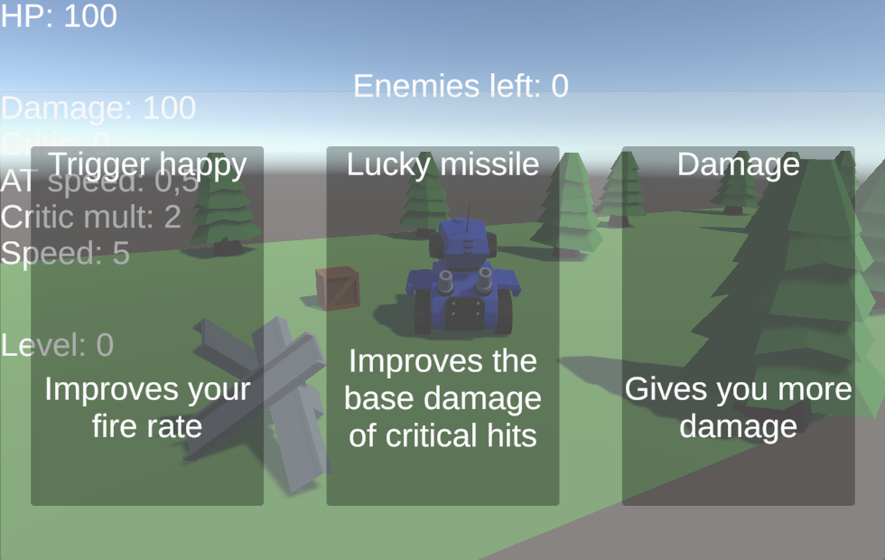
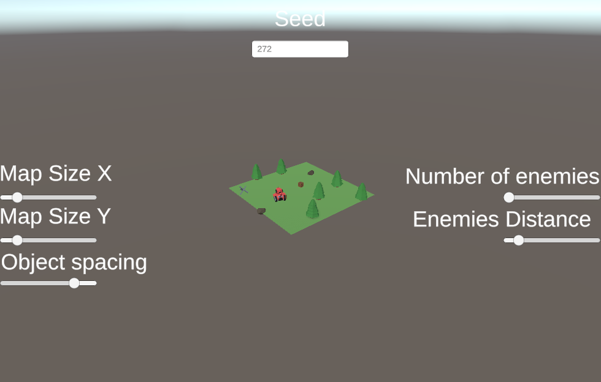
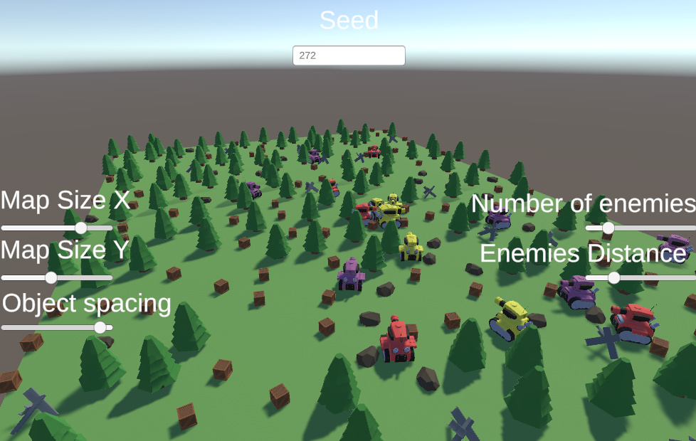

# 🎮 Tanks — Roguelike Shooter Game 
**Tanks** is a *roguelike shooter* developed in **Unity (C#)** where you control a tank through **procedurally generated levels**, facing enemies and collecting upgrades.

This project is part of my **Game Developer portfolio**, demonstrating advanced gameplay systems and programming skills.

---
## 🔹 Overview
In *Tanks*, the player can:
- 🤖 **Face enemies** with modular behavior using a **Finite State Machine (FSM)**.

- 🌍 **Explore procedurally generated levels** for replayability.

- ⚡ **Progress** by collecting upgrades and tackling increasing challenges.
---
## 🧠 Skills Demonstrated
 **Code Architecture & Patterns** -> OOP, FSM, Procedural Generation, Event driven |

 **Unity Development** -> Player mechanics, AI behaviors, Level systems |

 **Gameplay Design** -> Shooting system, Enemy behaviors, Dynamic levels |

---
## ⚙️ How to Run

```bash

git  clone  https://github.com/Kaizzendev/Tanks.git

Open  the  project  in  Unity (version 6000.3.12f1).

Load  the  "Game"  scene (Game.unity).

Press  Play  to  run  the  game.

```
---
## 📸 Screenshots & Gifs







---
## 🕹️ Playable Demo: Itch.io

👉 [**Tanks demo test on Itch.io**](https://kaizzendev.itch.io/tanksdemo)


---
## 📈 Roadmap
### ✅ Completed
- Modular FSM for enemies
- Procedural level generation
- Basic gameplay mechanics (movement, shooting, taking damage)
---
## 🚧 Next Goals
- Object Pool for projectiles and effects
- Implement progression system 
- Add main menu and polished UX (start menu, pause, options)
- Integrate sound design and particle effects
---
## 💡 Why This Project Stands Out
This project demonstrates real technical solutions to common game development problems:
- ⚙️ Scalable AI with FSM
- 🪛 Scalable Systems (FSM, event driven, OOP, Procedural generation)
- 🌐 Dynamic, replayable levels with procedural generation
- 🧩 Modular and maintainable code ready for expansion
---
## 📎 License
MIT License — see LICENSE file.